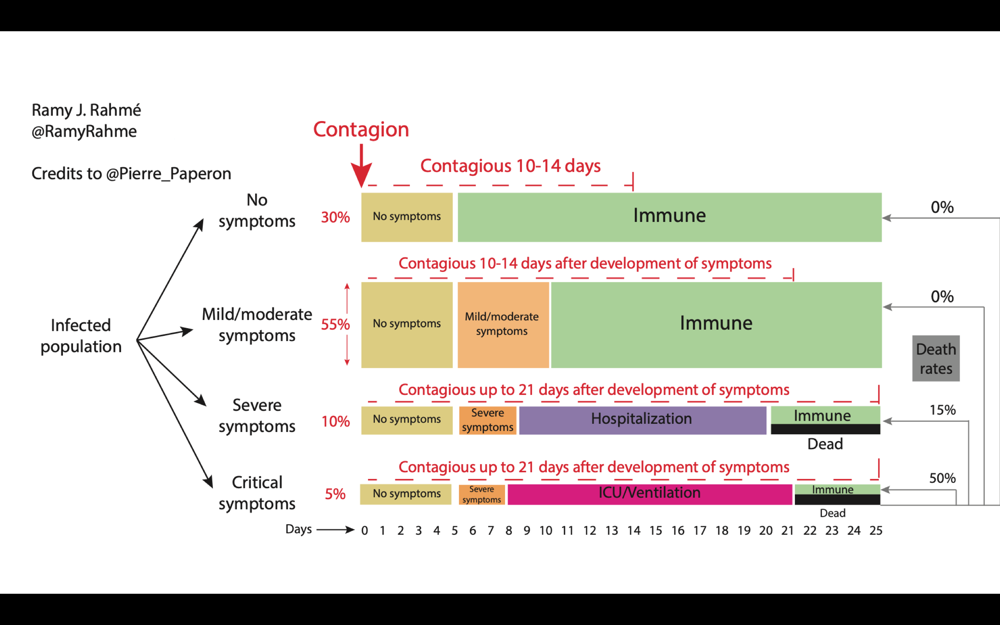

# Exploração de um modelo baseado em autômatos celulares estocásticos na dinâmica da COVID-19

[Clique aqui](https://doi.org/10.1007/978-3-030-69480-7_27) para acessar o artigo original. A implementação aqui proposta é uma evolução dos primeiros esboços apresentados neste artigo. A implementação deste modelo está escrita na linguagem Wolfram Language, nativa do _software_ Mathematica.

## Resumo dos parâmetros do modelo:

**Percentual de indivíduos imunes:** O reticulado inicial para execução do modelo pode ser populado previamente como uma quantidade n% de células no estado imune (consultar dicionário de estados no modelo) aleatoriamente distribuídas. Qualquer valor entre 0% e 100% pode ser colocado, desde que inteiro.

**Duração dos estados:** Conforme o modelo de referência acima colocado, cada estado possui uma duração específica em dias. Na modelagem proposta, a duração é calculada em função de uma distribuição normal cuja média é o número esperado de dias e a variação máxima é de 20% deste valor. O usuário pode alterar as durações conforme desejar.

**Probabilidade de contaminação:** A probabilidade de uma célula no estado suscetível ser contaminada é calculada em função de seus vizinhos, tirando-se uma média das probabilidades de contágio de seus respectivos estados. Estas probabilidades foram definidas em função de uma distribuição normal cuja média é a probabilidade esperada e o desvio padrão é de 3%.

**Probabilidade de óbito:** É a probabilidade de uma célula em estado hospitalizado mudar para o estado morto. Esta probabilidade foi definida em função de uma distribuição normal cuja média é a probabilidade esperada e o desvio padrão é de 3%.

**Tamanho da população:** O tamanho da população é definido no início da simulação em função de uma distribuição normal cuja média é o tamanho informado e o desvio padrão é de 15 indivíduos.
